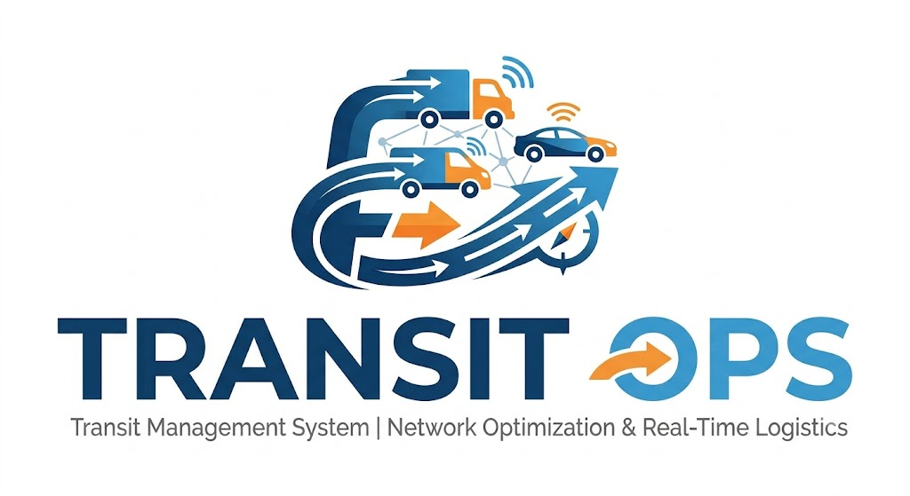

# 🚍 TransitOps 

## Smart Transport Operations Platform

<p align="center">
  
</p>

<p align="center">
  <b>A next-generation transport operations platform for fleet management, trip tracking, driver coordination, and intelligent transport analytics.</b>
</p>

<p align="center">


</p>

---

# 👥 Team Details

## Team Name

# Team Plenum

## Members

| Name   | Role                 | Contribution                        |
| ------ | -------------------- | ----------------------------------- |
| <Yajurshi_Dharmendra_Velani> | Team Lead            | Architecture, Planning, Integration |
| <Hency_Patel> | Backend Developer    | APIs, Database, Server Logic        |
| <Bhagyashree_Jadeja> | Frontend Developer   | UI, Dashboard, User Experience      |
| <Pragati_Varu> | Full Stack Developer | Features, Testing, Deployment       |

---

# 📌 Project Overview

## What is TransitOps?

TransitOps is a smart transport operations management platform designed to digitize and simplify transportation workflows.

The platform enables organizations to efficiently manage:

* Fleet operations
* Driver management
* Vehicle tracking
* Trip scheduling
* Transport analytics
* Operational monitoring

TransitOps provides a centralized platform where administrators and transport managers can monitor and control their complete transportation ecosystem.

---

# 🎯 Problem Statement

Traditional transportation systems struggle with:

* Manual fleet tracking
* Lack of centralized data
* Inefficient trip management
* Poor operational visibility
* Difficulty analyzing transport performance

TransitOps solves these challenges through automation, real-time monitoring, and intelligent dashboards.

---

# 💡 Solution Overview

TransitOps provides:

✅ Centralized transport management
✅ Real-time trip monitoring
✅ Fleet and driver management
✅ Interactive dashboards
✅ Secure authentication
✅ Data-driven insights

---

# ✨ Key Features

## 🔐 Authentication System

* Secure login system
* User authentication
* Role-based access
* Protected application routes

---

## 📊 TransitOps Dashboard

The dashboard provides:

* Total vehicles
* Active trips
* Driver statistics
* Route information
* Operational insights

Features:

* Interactive cards
* Data visualization
* Real-time statistics
* Quick navigation

---

## 🚍 Fleet Management

Manage:

* Vehicle information
* Vehicle availability
* Vehicle status
* Maintenance records

---

## 👨‍✈️ Driver Management

Includes:

* Driver profiles
* Assignment history
* Availability tracking
* Performance monitoring

---

## 🗺️ Trip Management

Complete trip lifecycle:

```
Create Trip

      ↓

Assign Vehicle

      ↓

Assign Driver

      ↓

Start Trip

      ↓

Track Progress

      ↓

Complete Trip
```

---

## 📍 Trip Tracking

Provides:

* Live trip monitoring
* Current trip status
* Route visibility
* Operational tracking

---

# 🏗️ System Architecture

```
                    USER

                      |

                      |

              React Frontend

                 (Client)

                      |

                      |

              REST API Layer

                 (Server)

                      |

                      |

             Business Logic

                      |

                      |

             SQLite Database


```

---

# 📂 Actual Project Structure

```
TransitOps/

│
├── client/
│
│   ├── public/
│   │
│   ├── src/
│   │   ├── components/
│   │   ├── pages/
│   │   ├── services/
│   │   ├── assets/
│   │   ├── routes/
│   │   └── App.*
│   │
│   └── package.json
│
│
├── server/
│
│   ├── controllers/
│   ├── routes/
│   ├── models/
│   ├── middleware/
│   ├── database/
│   ├── config/
│   ├── server.js
│   └── package.json
│
│
├── docs/
│
│   ├── architecture/
│   ├── screenshots/
│   └── documentation/
│
│
├── scripts/
│
│   ├── setup scripts
│   └── deployment scripts
│
│
├── .gitignore
│
├── README.md
│
├── package.json
│
└── package-lock.json

```

---

# 🛠️ Technology Stack

# Frontend

| Technology   | Usage             |
| ------------ | ----------------- |
| React.js     | User Interface    |
| JavaScript   | Application Logic |
| HTML5        | Structure         |
| CSS          | Styling           |
| React Router | Navigation        |
| Axios        | API Communication |

---

# Backend

| Technology | Usage                       |
| ---------- | --------------------------- |
| Node.js    | Runtime Environment         |
| Express.js | API Framework               |
| REST APIs  | Client-Server Communication |
| Middleware | Authentication & Validation |

---

# Database

| Technology  | Usage                |
| ----------- | -------------------- |
| SQLite      | Lightweight Database |
| SQL Queries | Data Management      |

---

# Development Tools

| Tool    | Purpose               |
| ------- | --------------------- |
| Git     | Version Control       |
| GitHub  | Repository Management |
| VS Code | Development           |
| npm     | Package Management    |

---

# 🔄 Application Workflow

```
User Login

    |

Authentication Verification

    |

Dashboard Access

    |

View Transport Data

    |

Manage Vehicles / Drivers / Trips

    |

Monitor Operations

    |

Generate Insights

```

---

# 🔌 Backend Architecture

```
server/

│
├── routes/

      API endpoints

│

├── controllers/

      Request handling

│

├── models/

      Database models

│

├── middleware/

      Authentication

│

├── database/

      Database connection

│

└── server.js

      Server initialization

```

---

# 🎨 Frontend Architecture

```
client/src/

│
├── pages/

   Login

   Dashboard

   Fleet

   Drivers

   Trips


├── components/

   Reusable UI Components


├── services/

   API Integration


├── routes/

   Application Routing


└── assets/

   Images and Resources

```

---

# ⚙️ Installation & Setup

## Clone Repository

```bash
git clone <repository-url>

cd TransitOps
```

---

# Install Dependencies

## Root

```bash
npm install
```

## Client

```bash
cd client

npm install
```

## Server

```bash
cd server

npm install
```

---

# Environment Configuration

Create:

```
server/.env
```

Add:

```
PORT=5000

DATABASE_URL=<database-path>

JWT_SECRET=<secret-key>

```

---

# Run Application

## Start Backend

```bash
cd server

npm start
```

Backend runs on:

```
http://localhost:5000
```

---

## Start Frontend

```bash
cd client

npm start
```

Frontend runs on:

```
http://localhost:3000
```

---

# 🔐 Security Features

Implemented:

* Authentication
* Protected routes
* API validation
* Secure database access
* Error handling

---

# 🚀 Future Enhancements

Future improvements:

* GPS based live tracking
* AI route optimization
* Predictive maintenance
* Mobile driver application
* Advanced analytics
* Notification system
* Cloud deployment

---

# 🏆 Why TransitOps?

TransitOps delivers:

✔ Complete transport ecosystem
✔ Modern full-stack architecture
✔ Scalable backend design
✔ Interactive user experience
✔ Real-world business impact

<p align="center">

Built with ❤️ by Team Plenum

</p>
